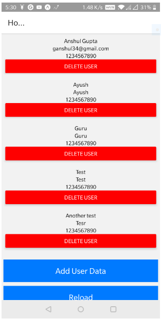
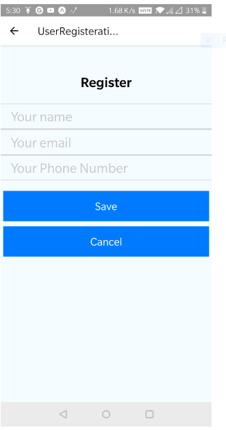

# React Native App

A react native app made with node and mongodb in the backend

When you're ready to see everything that Expo provides (or if you want to use your own editor) you can **Export** your project and use it with [expo-cli](https://docs.expo.io/versions/latest/introduction/installation.html).

## [Live Hosted version](https://snack.expo.io/@anshulg34/sampleapp)

There are 2 screens in the app

1. Home Screen
    
2. User Registeration Screen
  
In the above link you can directly open the app or download the [expo app](https://play.google.com/store/apps/details?id=host.exp.exponent&hl=en) and scan the generated QR code to open the app on the phone.
